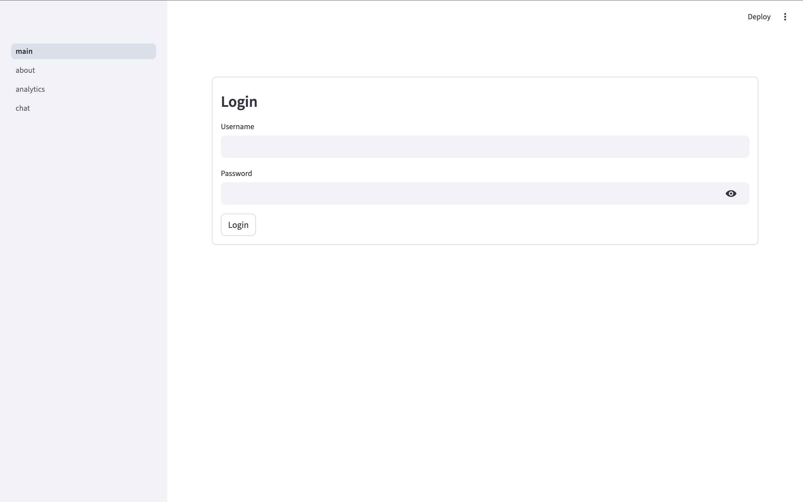
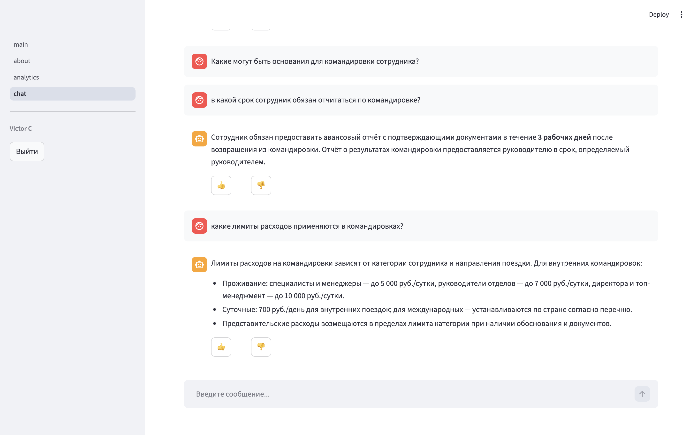
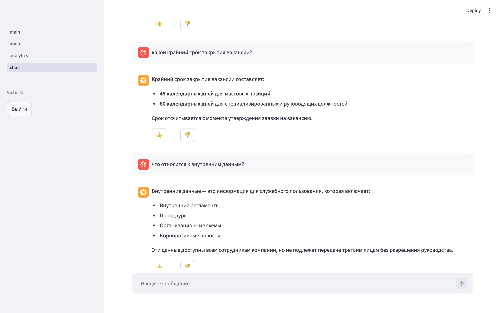

# README_APP — Конспект по Streamlit-приложению

Полное описание фронтенда: авторизация, чат, навигация, управление сессией.  
Охватывает: `main.py`, `modules/auth.py`, `pages/chat.py`, `pages/about.py`, `pages/analytics.py`.

---

## Оглавление

1. [Структура приложения](#1-структура-приложения)
2. [main.py — точка входа и авторизация](#2-mainpy--точка-входа-и-авторизация)
3. [modules/auth.py — модуль авторизации](#3-modulesauthpy--модуль-авторизации)
4. [pages/chat.py — страница чата](#4-pageschatpy--страница-чата)
5. [pages/about.py и pages/analytics.py — заглушки](#5-pagesaboutpy-и-pagesanalyticspy--заглушки)
6. [Полный цикл сессии пользователя](#6-полный-цикл-сессии-пользователя)
7. [Ключевые паттерны приложения](#7-ключевые-паттерны-приложения)

---

## 1. Структура приложения

```
project/
├── main.py                        # точка входа, форма логина
├── streamlit_credentials.yaml     # логины, хэши паролей, настройки cookie
├── modules/
│   └── auth.py                    # get_authenticator(), require_auth()
└── pages/
    ├── chat.py                    # чат с RAG-графом
    ├── about.py                   # заглушка "О системе"
    └── analytics.py               # заглушка "Аналитика"
```

Streamlit автоматически строит боковое меню из файлов в `pages/`. Имя файла без расширения становится пунктом меню. `main.py` — корневая точка входа, поддерживается с версии 1.28+.

### Конфигурация credentials

`streamlit_credentials.yaml` — файл с пользователями и настройками cookie:

```yaml
cookie:
  expiry_days: 30
  key: super_secret_key_change_me 
  name: rag_agent_cookie

credentials:
  usernames:
    victor:
      email: admin@example.com
      first_name: Admin
      last_name: One
      password: password123   # будет захэширован автоматически при первом запуске
      roles:
        - admin
    user2:
      email: user2@example.com
      first_name: User
      last_name: Two
      password: password456
      roles:
        - viewer
```

Пароли хранятся как bcrypt-хэши — библиотека `streamlit_authenticator` сравнивает хэши, не plaintext.

---

## 2. `main.py` — точка входа и авторизация

**Путь:** `main.py` (корень проекта)

### Настройка путей

```python
import sys
from pathlib import Path
sys.path.insert(0, str(Path(__file__).parent))
```

Добавляет корневую папку проекта в `sys.path` первой позицией. Без этого `from modules.auth import ...` и `from graph.builder import ...` упали бы с `ModuleNotFoundError` — Streamlit запускает страницы из разных рабочих директорий и не знает о структуре проекта.

`Path(__file__).parent` — директория где лежит сам `main.py`, то есть корень проекта.

### Инициализация страницы

```python
st.set_page_config(page_title="ИИ агент", layout="wide")
```

Обязан быть **первым вызовом Streamlit** в файле — до любых других `st.*`. Устанавливает заголовок вкладки браузера и режим разметки. `layout="wide"` — контент растягивается на всю ширину окна вместо узкой центральной колонки по умолчанию.

### Форма логина

```python
authenticator = get_authenticator()
authenticator.login(location="main")
```

`get_authenticator()` читает YAML и создаёт объект `stauth.Authenticate`. `authenticator.login(location="main")` рендерит форму прямо в основной области страницы (альтернатива — `location="sidebar"`).

После отправки формы библиотека записывает в `st.session_state` три ключа:

| Ключ | Тип | Значение |
|------|-----|---------|
| `authentication_status` | `bool \| None` | `True` / `False` / `None` |
| `name` | `str` | Отображаемое имя из YAML |
| `username` | `str` | Логин пользователя |

### Обработка статусов

```python
if st.session_state.get("authentication_status") is False:
    st.error("Неверный логин или пароль")
    st.stop()

if st.session_state.get("authentication_status") is None:
    st.stop()
```

Используется строгое `is False` и `is None` — принципиально важно. `not None` тоже было бы `True`, что показало бы сообщение об ошибке при первом открытии страницы до любого ввода. Три состояния и их смысл:

| `authentication_status` | Ситуация | Действие |
|------------------------|----------|---------|
| `None` | Страница только открыта, форма не отправлялась | Показать форму, ждать |
| `False` | Введены неверные данные | Показать ошибку |
| `True` | Успешный вход | Продолжить выполнение |

`st.stop()` прерывает выполнение скрипта — всё что ниже не рендерится.

### Контент после авторизации

```python
with st.sidebar:
    st.caption(f"**{st.session_state['name']}**")
    authenticator.logout("Выйти", location="sidebar")

st.title(f"Добро пожаловать, {st.session_state['name']}")
st.write("Выберите раздел в меню слева.")
```

До этих строк доходим только при `authentication_status is True`. Сайдбар: имя пользователя мелким жирным шрифтом + кнопка выхода. При нажатии "Выйти" библиотека очищает `session_state` и удаляет cookie из браузера.

---

## 3. `modules/auth.py` — модуль авторизации

**Путь:** `modules/auth.py`

Два инструмента: фабрика аутентификатора и защитная функция для страниц.

### `get_authenticator()`

```python
def get_authenticator():
    with open("streamlit_credentials.yaml") as f:
        config = yaml.load(f, Loader=SafeLoader)
    return stauth.Authenticate(
        config["credentials"],
        config["cookie"]["name"],
        config["cookie"]["key"],
        config["cookie"]["expiry_days"],
    )
```

Читает YAML при каждом вызове — файл небольшой, зато изменения подхватываются без перезапуска приложения. `SafeLoader` вместо дефолтного `Loader` — защита от выполнения произвольного Python-кода через YAML.

Четыре параметра `stauth.Authenticate`:
- `credentials` — словарь пользователей с bcrypt-хэшами паролей
- `cookie["name"]` — имя cookie в браузере пользователя
- `cookie["key"]` — секретный ключ подписи cookie (это и есть `COOKIE_PASSWORD` из ошибки Pydantic — должен быть в `.env` и прокинут в `settings`)
- `cookie["expiry_days"]` — сколько дней живёт cookie (автологин при повторном визите)

### `require_auth()`

```python
def require_auth() -> str:
    if st.session_state.get("authentication_status") is not True:
        st.warning("Необходима авторизация")
        st.page_link("main.py", label="Войти")
        st.stop()

    authenticator = get_authenticator()
    with st.sidebar:
        st.caption(f"**{st.session_state['name']}**")
        authenticator.logout("Выйти", location="sidebar")

    return st.session_state["username"]
```

Защитная обёртка — вызывается первой строкой на каждой защищённой странице. Логика:

Если не авторизован — `st.warning` показывает предупреждение, `st.page_link` рендерит кликабельную ссылку на `main.py`, `st.stop()` блокирует рендер контента страницы.

Если авторизован — рисует сайдбар с именем и кнопкой выхода, возвращает `username`.

Возвращаемое значение `username` используется в `chat.py` как `thread_id` — **логин пользователя становится ключом его персональной истории** в PostgreSQL.

---

## 4. `pages/chat.py` — страница чата

**Путь:** `pages/chat.py`

Самая сложная страница — интеграция Streamlit с LangGraph.

### Настройка путей и авторизация

```python
sys.path.insert(0, str(Path(__file__).parent.parent))
```

`.parent.parent` — подъём из `pages/` в корень проекта (на уровень выше чем в `main.py`).

```python
st.set_page_config(page_title="Чат", layout="wide")
thread_id = require_auth()
```

`require_auth()` возвращает `username` — сохраняем в `thread_id`. Все обращения к графу будут с этим идентификатором, изолируя историю каждого пользователя.

### Кэшированный граф

```python
@st.cache_resource(show_spinner="Загружаю систему...")
def get_graph():
    return build_graph(use_checkpointer=True)

try:
    graph = get_graph()
except Exception as e:
    st.error(f"Ошибка загрузки графа: {e}")
    st.stop()
```

`@st.cache_resource` — кэширует объект на уровне всего приложения (не одной сессии). Граф создаётся **один раз** при первом обращении любого пользователя и переиспользуется всеми. Без кэша каждый рендер страницы создавал бы новый граф с новым подключением к PostgreSQL — недопустимо.

Отличие от `@st.cache_data`: `cache_data` сериализует результат и делает копию при каждом обращении (для простых данных). `cache_resource` возвращает один и тот же объект — подходит для подключений к БД, ML-моделей, графов.

`use_checkpointer=True` — граф с PostgreSQL-checkpointer'ом. История диалога сохраняется между сессиями.

`try/except` на уровне инициализации — если PostgreSQL или ChromaDB недоступны, пользователь видит читаемое сообщение, а не трейсбек.

### Генератор для стриминга

```python
def stream_text(text: str, delay: float = 0.015):
    for ch in text:
        yield ch
        time.sleep(delay)
```

Генератор — отдаёт по одному символу с задержкой 15 мс. Создаёт эффект живого печатания. `yield` делает функцию генератором — `st.write_stream()` вызывает `next()` и получает символы по одному, добавляя их в интерфейс без перерисовки всего компонента.

`delay=0.015` — 15 мс на символ, ~67 символов в секунду. При среднем ответе в 200 символов анимация длится ~3 секунды.

### Конфиг треда

```python
config = {"configurable": {"thread_id": thread_id}}
```

Структура конфига LangGraph checkpointer. `thread_id` — идентификатор в PostgreSQL. При каждом `graph.invoke(config=config)` или `graph.get_state(config)` LangGraph автоматически загружает и сохраняет состояние именно этого треда. Пользователь `"ivan"` никогда не увидит историю пользователя `"maria"`.

### Загрузка и отображение истории

```python
state = graph.get_state(config)
history = state.values.get("messages", []) if state and state.values else []
```

При каждом открытии страницы загружаем текущее состояние треда из PostgreSQL. `state` может быть `None` у нового пользователя — двойная проверка `if state and state.values` защищает от этого.

```python
for msg in history:
    if isinstance(msg, HumanMessage):
        with st.chat_message("user"):
            st.write(msg.content)
    elif isinstance(msg, AIMessage) and msg.content and not msg.tool_calls:
        with st.chat_message("assistant"):
            st.write(msg.content)
```

Фильтрация `AIMessage` двойная и обязательная:
- `msg.content` — пропускаем пустые сообщения (бывают при некоторых состояниях графа)
- `not msg.tool_calls` — пропускаем технические сообщения с вызовами инструментов

Без второго фильтра пользователь видел бы служебные JSON-объекты:
```json
[{"name": "retrieve_docs", "args": {"query": "ключевые слова"}, "id": "..."}]
```

`st.chat_message("user")` и `st.chat_message("assistant")` — контекстные менеджеры, оборачивают контент в пузырь с аватаркой соответствующего типа.

### Обработка нового сообщения

```python
if prompt := st.chat_input("Введите сообщение..."):
```

`:=` — моржовый оператор. Одновременно рендерит поле ввода внизу страницы, присваивает введённый текст в `prompt` и проверяет что он не пустой. Блок выполняется только при отправке сообщения.

```python
    with st.chat_message("user"):
        st.write(prompt)
```

Показываем вопрос пользователя немедленно — до запуска графа. Важно для UX: без этого интерфейс "замирал" бы на несколько секунд без обратной связи.

```python
    with st.spinner("Ищу информацию..."):
        result = graph.invoke(
            {"messages": [HumanMessage(content=prompt)]},
            config=config,
        )
```

`graph.invoke` — синхронный вызов. Полный цикл внутри:
1. LangGraph загружает состояние треда из PostgreSQL
2. Добавляет новый `HumanMessage` к истории
3. Прогоняет через все узлы графа (query → retrieve → grade → answer → summarizer)
4. Сохраняет обновлённое состояние обратно в PostgreSQL
5. Возвращает финальное состояние в `result`

`st.spinner` показывает крутилку с текстом пока граф работает (может занять 3–10 секунд).

```python
    ai_msg = result["messages"][-1]

    with st.chat_message("assistant"):
        st.write_stream(stream_text(ai_msg.content))

    st.rerun()
```

`result["messages"][-1]` — последнее сообщение в финальном состоянии, это ответ ИИ.

`st.write_stream(stream_text(...))` — передаёт генератор в Streamlit. Символы появляются один за другим, создавая эффект печатания.

`st.rerun()` — принудительная перезагрузка страницы после получения ответа. Нужна чтобы обновить историю в верхней части — `st.write_stream` добавил ответ в интерфейс текущего рендера, но при следующем открытии без `rerun()` страница могла бы показать дублирующиеся сообщения.

```python
    except Exception as e:
        st.error(f"Ошибка: {str(e)}")
        st.exception(e)
```

`st.error` — красный блок с коротким сообщением. `st.exception(e)` — разворачивает полный трейсбек прямо в интерфейсе, удобно при отладке. В продакшене `st.exception` обычно убирают.

---

## 5. `pages/about.py` и `pages/analytics.py` — заглушки

Минимальный шаблон защищённой страницы:

```python
sys.path.insert(0, str(Path(__file__).parent.parent))  # корень проекта

import streamlit as st
from modules.auth import require_auth

st.set_page_config(page_title="Название", layout="wide")

require_auth()   # проверка авторизации + сайдбар

st.title("Название")
st.write("Контент страницы...")
```

Этот же паттерн будет использоваться для всех новых страниц. Достаточно скопировать заглушку и добавить контент после `require_auth()`.

---

## 6. Полный цикл сессии пользователя

```
1. ПЕРВЫЙ ВИЗИТ
   Открывает main.py
   authentication_status = None → форма логина, st.stop()

2. ВХОД
   Вводит логин + пароль → библиотека сравнивает bcrypt-хэши
   authentication_status = True
   session_state["name"]     = "Иван"
   session_state["username"] = "ivan"
   Cookie сохраняется в браузере (живёт expiry_days дней)

3. ЧАТ
   Переходит на /chat
   require_auth() → True → thread_id = "ivan"
   graph.get_state({"thread_id": "ivan"}) → история из PostgreSQL
   Рендерит историю в пузырях

4. ОТПРАВКА СООБЩЕНИЯ
   prompt → HumanMessage → graph.invoke(config={"thread_id": "ivan"})
   PostgreSQL: загрузить состояние → RAG-граф → сохранить состояние
   st.write_stream(stream_text(ответ)) → анимация печатания
   st.rerun() → обновление истории

5. ПОВТОРНЫЙ ВИЗИТ (cookie жив)
   authentication_status = True автоматически (cookie валиден)
   История загружается из PostgreSQL → продолжает с того места

6. ВЫХОД
   Нажимает "Выйти" в сайдбаре
   authenticator.logout() → session_state очищается, cookie удаляется
   Страница перезагружается → форма логина
```





---

## 7. Ключевые паттерны приложения

### `sys.path.insert` в каждом файле

| Файл | Вызов |
|------|-------|
| `main.py` | `Path(__file__).parent` — корень |
| `pages/*.py` | `Path(__file__).parent.parent` — на уровень выше |

Без этого импорты из `modules/` и `graph/` не работают.

### Порядок вызовов Streamlit

Каждая страница обязана соблюдать порядок:
```
1. st.set_page_config()   ← первый и обязательный
2. require_auth()         ← до любого контента
3. контент страницы
```

### `@st.cache_resource` для тяжёлых объектов

Граф создаётся один раз на всё приложение. Если нужно добавить другие тяжёлые объекты (модели, подключения к БД) — оборачивать в `@st.cache_resource` по тому же паттерну.

### Отладка через `logs/debug.log`

При разработке и диагностике все ключевые события графа пишутся в `logs/debug.log` в корне проекта. Файл создаётся автоматически при первом запуске. Удобно следить хвостом:

```bash
tail -f logs/debug.log
```

Streamlit hot-reload не дублирует записи — логгеры защищены проверкой `if not logger.handlers`.

### `thread_id` = `username`

Изоляция истории пользователей через LangGraph checkpointer. Один пользователь — один тред в PostgreSQL — своя история диалога. При необходимости можно реализовать несколько тредов на пользователя (разные темы разговора) передавая другой `thread_id`.

### Фильтрация сообщений для отображения

Из истории показываем только:
- `HumanMessage` — всегда
- `AIMessage` у которого `content` не пустой и нет `tool_calls`

Всё остальное (`ToolMessage`, `AIMessage` с `tool_calls`) — внутренняя кухня графа, пользователю не нужна.

### Моржовый оператор в `chat_input`

```python
if prompt := st.chat_input("..."):
```

Стандартный паттерн для чат-интерфейсов в Streamlit — рендер поля + проверка непустоты в одну строку.

---

*Конец документа. Все три README (README_GRAPH, README_CHROMA, README_APP) покрывают проект полностью.*